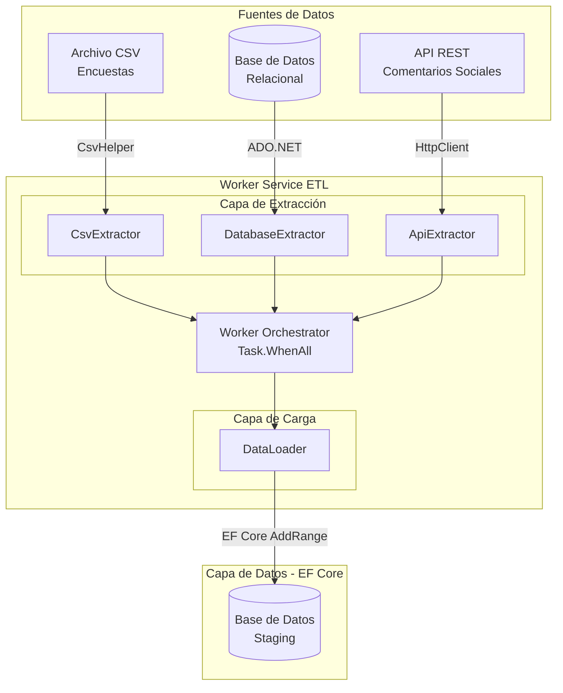
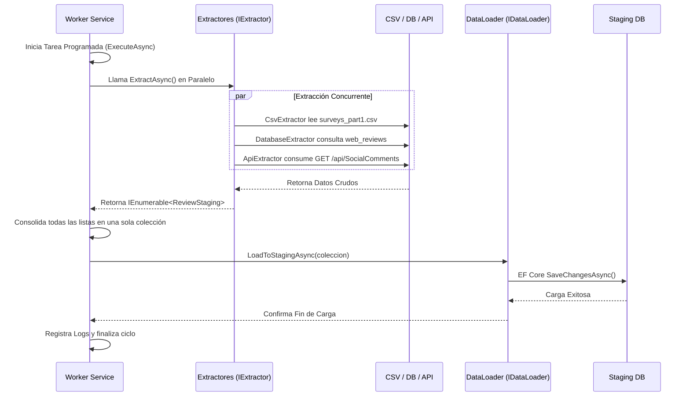

# Documento Técnico: Proceso de Extracción ETL

## 1. Diagrama de Arquitectura (Conceptual)

El siguiente diagrama detalla la arquitectura orientada a servicios para el proceso de extracción, aplicando Clean Architecture.

## 2. Diagrama de Flujo del Proceso ETL (Fase de Extracción)

## 3. Justificación de las Decisiones Técnicas Adoptadas

Para garantizar que la arquitectura propuesta cumple con los atributos de calidad requeridos por el negocio, se adoptaron las siguientes estrategias técnicas:

### Rendimiento (Procesamiento Eficiente)
*   **Paralelismo (Asincronía):** En `Worker.cs`, se utiliza `Task.WhenAll(extractionTasks)` para ejecutar los tres extractores de manera simultánea. En lugar de tardar la suma del tiempo de cada fuente, el tiempo total será aproximadamente el de la fuente más lenta.
*   **ADO.NET para Orígenes Complejos:** Se empleó `SqlConnection` y `SqlCommand` puros en `DatabaseExtractor` para consultar rápidamente las tablas OLTP sin la sobrecarga del tracking de Entity Framework.
*   **Bulk Inserts:** El `DataLoader` utiliza `AddRangeAsync()` de EF Core, lo cual optimiza la inserción masiva en la tabla de *Staging*.

### Escalabilidad (Facilidad para agregar fuentes)
*   **Clean Architecture (Inversión de Dependencias):** Se definió la interfaz genérica `IExtractor`. El orquestador (`Worker.cs`) no conoce las implementaciones concretas, solo interactúa con un `IEnumerable<IExtractor>`. 
*   Si mañana el negocio requiere extraer datos de MongoDB o un FTP, basta con crear una nueva clase que implemente `IExtractor` y registrarla en el contenedor de inyección de dependencias en `Program.cs`. El Worker la ejecutará automáticamente sin modificar su código.

### Seguridad (Protección de Credenciales)
*   **Configuraciones Externas (`appsettings.json`):** Ninguna cadena de conexión, ruta de archivo o URL está codificada ("hardcoded") en las clases de C#. Se leen a través del patrón `IOptions` e `IConfiguration`.
*   Para despliegues productivos, .NET 8 permite sobrescribir estas variables fácilmente usando *Environment Variables* o *Azure Key Vault*, protegiendo la información sensible sin tocar el código fuente.

### Mantenibilidad (Separación de Responsabilidades)
*   **Estructura de Proyectos:** Se aisló la definición de las entidades (`EtlProject.Data`) de la lógica de orquestación (`EtlProject.Worker`).
*   **Uso de Interfaces:** El código depende de abstracciones y no de implementaciones (Principios SOLID: Single Responsibility e Interface Segregation).
*   **Trazabilidad Continua:** Se integró *Serilog* para enviar logs estructurados a la Consola y a archivos físicos (`Logs/etl_log.txt`), facilitando el monitoreo de la salud del ETL.
